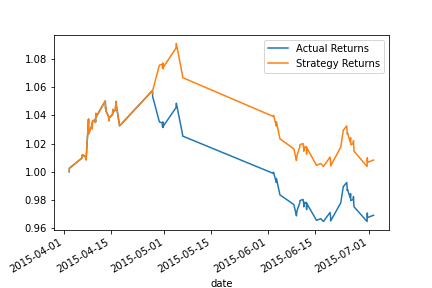
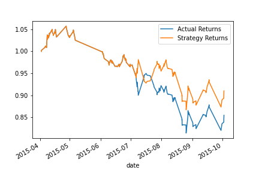
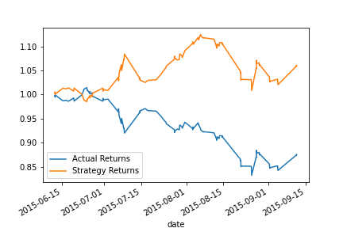
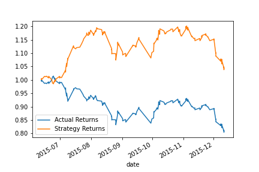
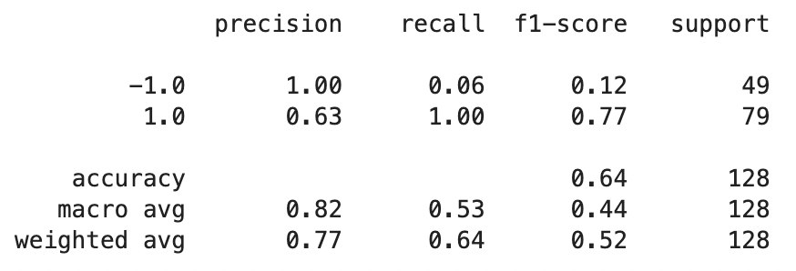
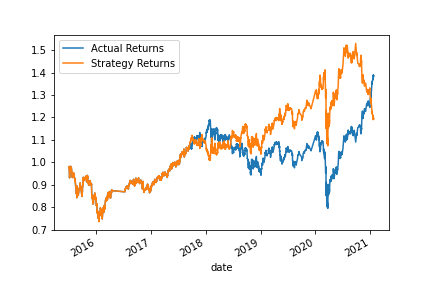
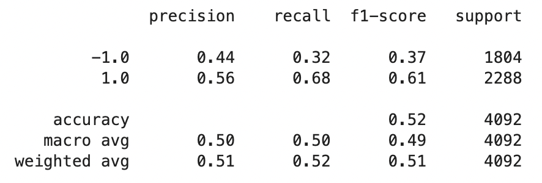

# Machine Learning Trading Bot

## Overview of the Analysis

This analysis seeks to improve the existing algorithmic trading systems and maintain competitive advantage in the market by enhancing the existing trading signals with machine learning algorithms that can adapt to new data. Using the skills in financial Python programming and machine learning we have created an algorithmic trading bot that learns and adapts to new data and evolving markets.

## Tuning the Baseline Trading Algorithm

### Step 1: What impact resulted from increasing or decreasing the training window?

When we increased the trianing window, the testing dataset increased, thus increaseing the graph window.

### Step 2: What impact resulted from increasing or decreasing either or both of the SMA windows?

When we increase the SMA windows (to 8 for short and 200 for long), we not only increase the dataset, but also push out the rolling average to give us a different view.

### Step 3: Graph PNGs

Original Model:

Increased Training Window:

Increased SMA Window:

Increased Training + SMA Window:

## Conclusions and Analysis

Baseline Model:

Tuned Trading Model:

Logistics Regression Model:

Through this analysis, the modeled graphs, and the classification reports it looks like the new model performed worse than the baseline model, espsecially in precision. Although the new model had higher support, the precision for both trading signals were relatively low in comparison to the baseline model. The accuracy of the original model also outperforms the accuracy of the logistics regression model.

The new model seemed to perform as well as the tuned trading algorithm. When looking at the graphs and the classification reports, although the tuned model has a higher average precision with less support, the accuracy between the two models are relatively similar hovering around 52-55%. The tuned model is thus slightly better than the new logistics regression model.

So overall, it seems that the new model's performance lacks in comparison to the original and tuned model, howver we need to keep in mind that the original and tuned model both have relatively small support sizes due to the training and SMA windows, which can cause the variation in the precision and accuracy when compared to the logistics regression model, which has a much larger support size.